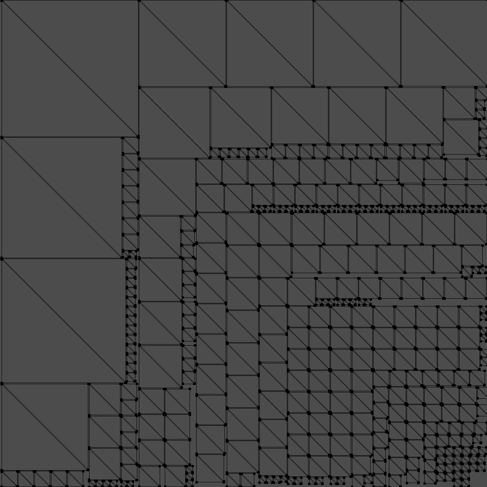

# trianglepacker
this library that help to packs triangles of a 3D mesh into a texture.


# TODO
* increases resource utilization

# Usage
```
if (!ray::uvmapper::lightmappack(
    // consecutive triangle positions
    vertices.data(), vertices.size(), 
    // resolution
    512, 512, 
    // scale the vertices
    1.0, 
    // margin
    1, 
    // output (a normalized uv coordinate for each input vertex):
    uvs.data()))
{
    std::cerr << stderr, "Failed to pack all triangles into the map!\n";
    return false;
}
```

[License (MIT)](https://raw.githubusercontent.com/ray-cast/trianglepacker/master/LICENSE.txt)
-------------------------------------------------------------------------------
    MIT License

    Copyright (c) 2018 Rui

	Permission is hereby granted, free of charge, to any person obtaining a
	copy of this software and associated documentation files (the "Software"),
	to deal in the Software without restriction, including without limitation
	the rights to use, copy, modify, merge, publish, distribute, sublicense,
	and/or sell copies of the Software, and to permit persons to whom the
	Software is furnished to do so, subject to the following conditions:

	The above copyright notice and this permission notice shall be included
	in all copies or substantial portions of the Software.

	THE SOFTWARE IS PROVIDED "AS IS", WITHOUT WARRANTY OF ANY KIND, EXPRESS
	OR IMPLIED, INCLUDING BUT NOT LIMITED TO THE WARRANTIES OF MERCHANTABILITY,
	FITNESS FOR A PARTICULAR PURPOSE AND NONINFRINGEMENT.  IN NO EVENT SHALL
	BRIAN PAUL BE LIABLE FOR ANY CLAIM, DAMAGES OR OTHER LIABILITY, WHETHER IN
	AN ACTION OF CONTRACT, TORT OR OTHERWISE, ARISING FROM, OUT OF OR IN
	CONNECTION WITH THE SOFTWARE OR THE USE OR OTHER DEALINGS IN THE SOFTWARE.